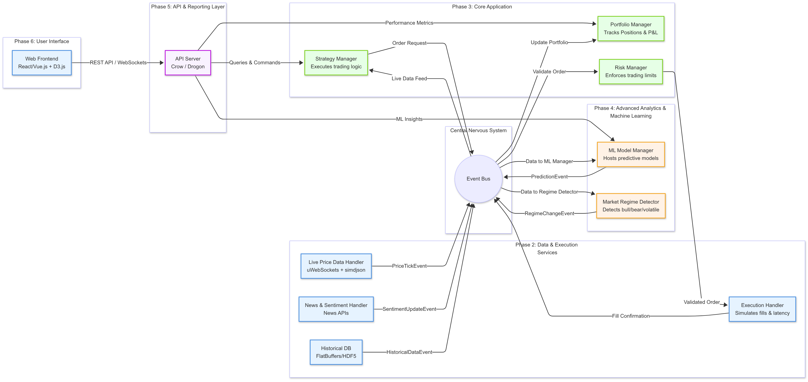

# Trading System Framework

A modular C++ event‑driven trading/backtesting framework focused on clean abstractions, extensibility, and performance awareness.

## Features
- Event‑driven architecture (market, signal, order, fill, news events)
- Pluggable strategies (Strategy base + concrete implementations)
- Risk & portfolio management layers
- Multiple data sources (historical CSV, news, websocket stub)
- Analytics: walk‑forward, optimization, Monte Carlo, regime detection, ML model manager
- API server placeholder for external integration
- Performance monitoring (timers, performance tests)
- Config parsing & structured logging
- Unit, integration, performance tests (CTest)

## High‑Level Flow


DataHandler → EventBus → Strategy → RiskManager → PortfolioManager → ExecutionHandler → (fills back as events)
Offline analytics modules (optimizer, walk‑forward, Monte Carlo, regime detection, ML) operate on stored data/results.

## Directory Structure
- include/, src/: Headers & implementations (mirrored)
- core/: Application, EventBus, Portfolio, logging, common types
- data/: Data handlers (historic, news, websocket)
- strategy/: Base strategy + concrete strategies + manager
- execution/: Execution handler abstraction
- risk/: Risk manager
- analytics/: Optimization, walk‑forward, Monte Carlo, regime detection, ML, aggregate analytics
- utils/: Timing / performance helpers
- config/: Config & parser
- api/: API server stub
- tests/: Unit, integration, performance tests, sample data

## Build
```bash
mkdir -p build
cd build
cmake ..
make -j$(nproc)
```

## Run (example)
```bash
./app            # If target name differs, list with: ls build
```

## Tests
```bash
cd build
ctest --output-on-failure
```

## Key Principles
Single Responsibility, Separation of Concerns, Dependency Inversion, Strategy & Observer patterns (via EventBus), modular extensibility, testability, performance awareness.

## Core Data Structures (Examples)
- std::vector: Collections (strategies, Monte Carlo paths)
- std::unordered_map: Symbol → position, config key → value
- std::queue/deque: Event dispatch buffering
- Smart pointers (unique_ptr/shared_ptr): Polymorphic ownership
- std::chrono: Timing, performance metrics
- Enums & variant event types (in Event system)

## Extending
1. Add a new Strategy: create header/source inheriting Strategy, register in StrategyManager.
2. Add a data source: subclass DataHandler, publish events to EventBus.
3. Add analytics module: implement component, integrate via Analytics orchestrator.
4. Add risk rule: extend RiskManager logic or modularize into rule set.

## Interview Talking Points
Event‑driven design, Strategy pattern, risk vs execution separation, walk‑forward & Monte Carlo for robustness, avoiding overfitting, dependency inversion via pure virtual interfaces, performance instrumentation.

## Roadmap Ideas
- Concurrency & thread-safe EventBus
- Object pooling for high-frequency events
- Enhanced ML pipeline (feature store, model versioning)
- Real exchange connectivity adapters

## License
(Add a license section if applicable.)

## Disclaimer
For educational / research use.